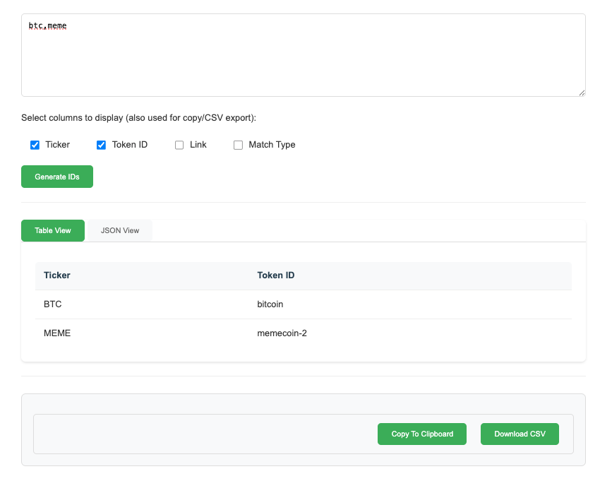

# CoinGecko ID Finder

A web application that helps you find CoinGecko IDs for cryptocurrency tickers. Built out of the frustration with CoinGecko's unintuitive ID system, this tool finds CoinGecko IDs based on just a ticker symbol. Results are initially filtered by market capitalization, with additional granular sorting options available.

## Screenshot


## Features

- 🔍 Find CoinGecko IDs using ticker symbols (e.g., BTC, ETH, USDT)
- 📊 Results filtered by market capitalization
- 🔄 Fuzzy matching for similar tickers
- 📱 Clean, modern web interface
- 📋 View results in table or JSON format
- 📥 Export results to CSV or copy to clipboard
- ⚡ Fast and efficient search algorithm


## Installation

1. Clone the repository:
```bash
git clone https://github.com/extrasubstance/CoinGecko_ID_Finder.git
cd CoinGecko_ID_Finder
```

2. Create and activate a virtual environment:
```bash
python -m venv venv
source venv/bin/activate  # On Windows, use: venv\Scripts\activate
```

3. Install dependencies:
```bash
pip install -r requirements.txt
```

## Usage

1. Start the Flask application:
```bash
python app.py
```

2. Open your web browser and navigate to:
```
localhost
```

3. Enter your cryptocurrency tickers (separated by commas) in the text area
4. Click "Generate IDs" to fetch the CoinGecko IDs
5. View results in either table or JSON format
6. Select which columns you want to display/export
7. Copy results to clipboard or download as CSV

## Dependencies

- Flask==3.0.2
- numpy==1.26.4
- pandas==2.2.1
- python-dotenv==1.0.1
- requests==2.31.0
- tqdm==4.67.0

## Project Structure

- `app.py`: Main Flask web application
- `search_utils.py`: Search functionality for finding token IDs
- `generate_mapping.py`: Script to generate token mappings
- `common_mapping.py`: Pre-generated mappings of common tokens
- `templates/index.html`: Web interface
- `requirements.txt`: Project dependencies

## Contributing

Contributions are welcome! Please feel free to submit a Pull Request.

## License

This project is licensed under the MIT License - see the LICENSE file for details.

## Disclaimer

This tool is not affiliated with CoinGecko. It was built to help developers and users find CoinGecko IDs more easily.
